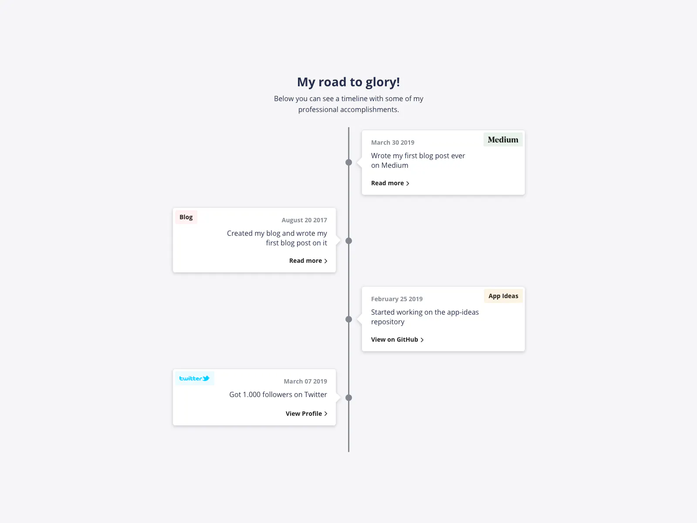

# My Challenge Road Map

This project visualizes a timeline of challenges completed on the iCodeThis platform. The timeline is designed with a modern, mobile-first approach and includes a dark mode toggle for user accessibility.

## Features

- **Responsive Design:** The layout adapts seamlessly to various screen sizes.
- **Dark Mode:** A toggle button to switch between light and dark themes.
- **Animated Timeline:** The timeline items reveal themselves with a smooth fade-in effect.

## Technologies Used

- **HTML5**
- **CSS3** (including custom properties for theme switching)
- **JavaScript** (for dynamic content and theme toggling)

## Differences from Original Design

- **Background:** The original design used a minimalist light background with grey tones, whereas this implementation features a vibrant gradient background with purple hues.
- **Dark Mode:** The original design did not include a dark mode toggle.
- **Animation:** The fade-in animation for timeline items was not present in the original design.

## Screenshots

### Updated Design

### Original Design

## How to Run

1. Clone the repository.
2. Open `index.html` in your browser.
3. Toggle between light and dark themes using the button at the top left.
